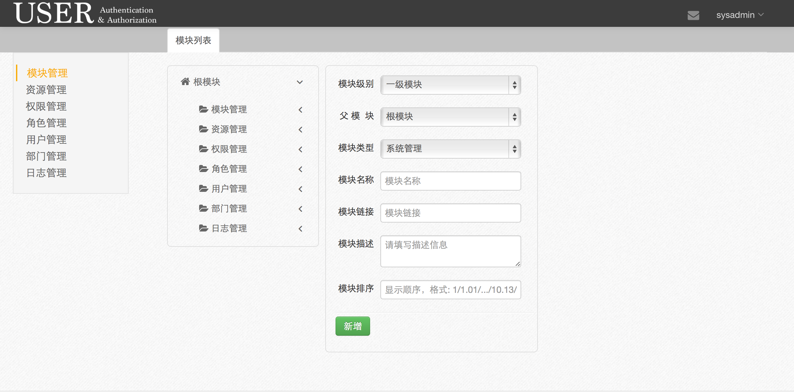
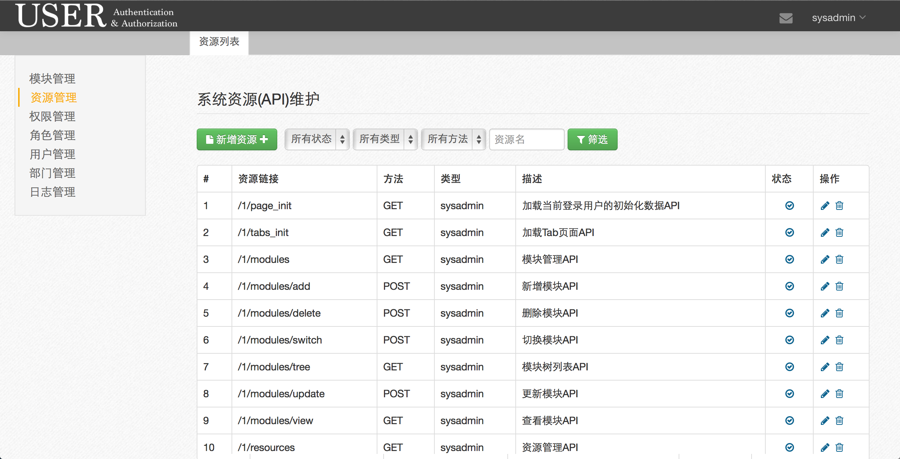
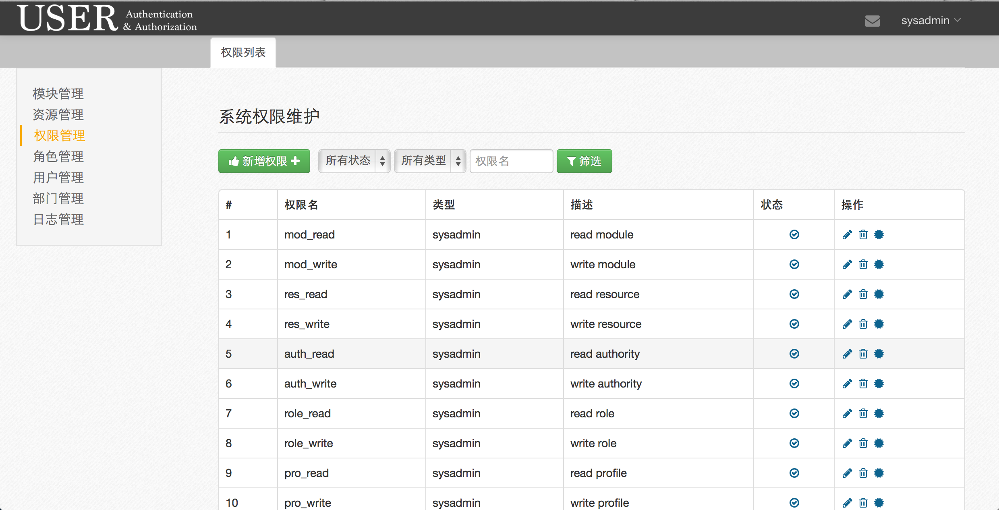
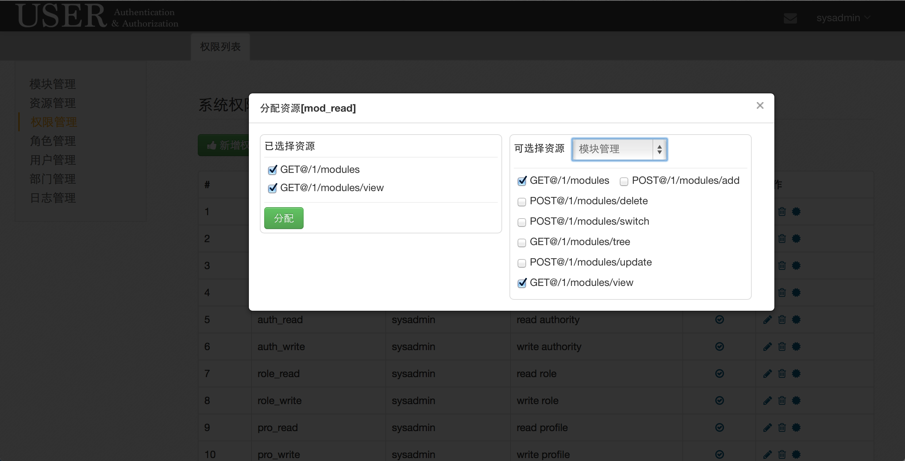
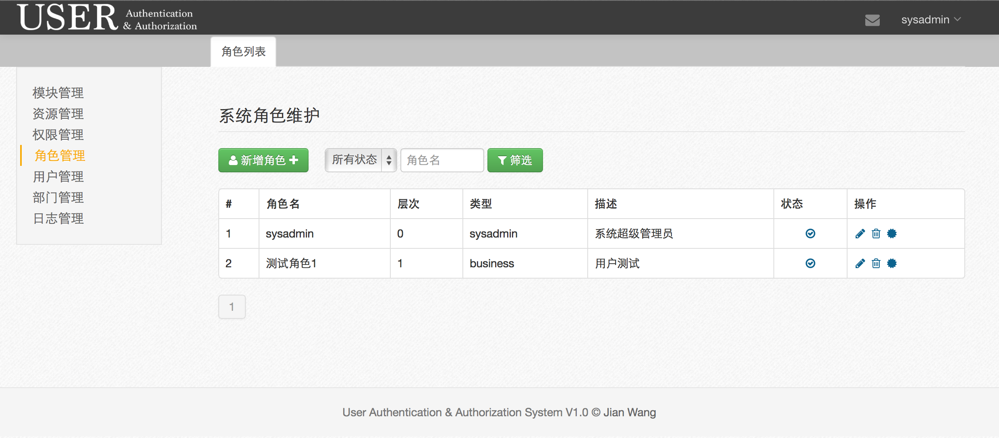
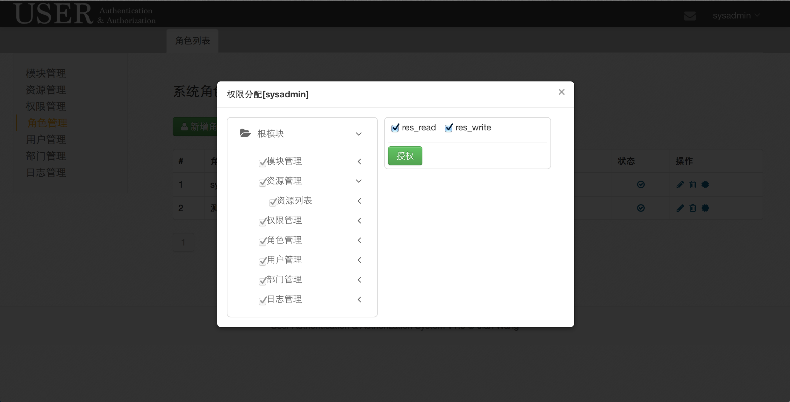
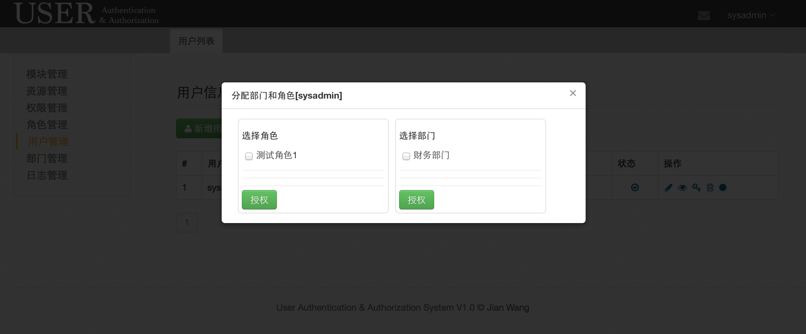
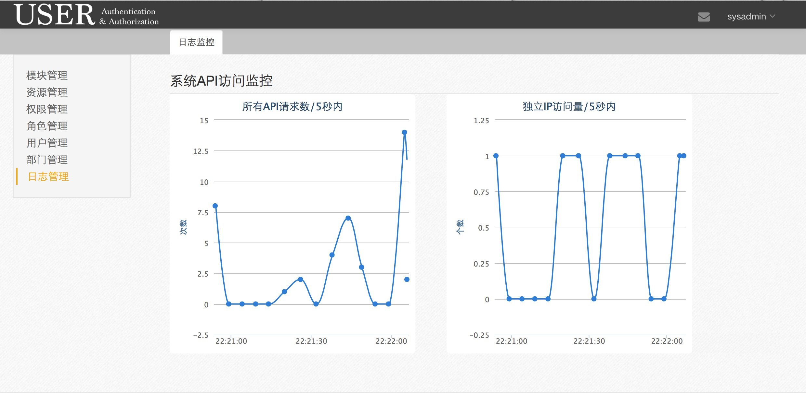

##Technique Details
UAA is a role based access control and management system which is applied to systems using RESTful API.

**Server**： mysql + jetty/tomcat

**Backend**： Servlet3.0 ＋ Jersey + Spring3.2.3 + mybatis

**Frontend**： Bootstrap2.3

**Database**：

##Function Details
 module management

 resource(API) management

 authority management

 role management
 
 user management
 api access log monitor